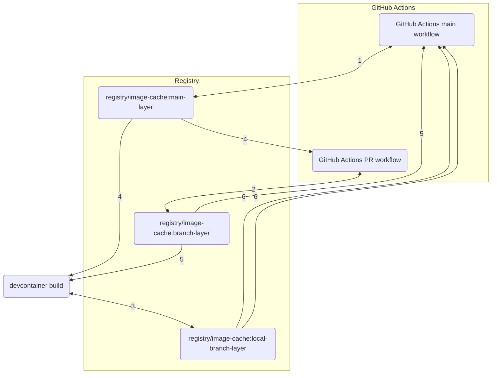

# devcontainer-cache-build

Build devcontainer images using remote Docker cache. This repo contains definitions for a complete workflow around the devcontainer image, including configuration for local building and cache population by CI pipeline.

## Usage

This repo defines tooling for the entire lifecycle of a devcontainer cache. Based on the context of the script call, `devcontainer-cache-build-initialize` supplies build configuration to target cache to refs for each event in that lifecycle, as described below:



1. GitHub Actions default branch workflows populate the cache for each layer, under the `main` ref.
2. GitHub Actions PR workflows populate the cache for each layer, under the ref for the PR branch name.
3. Devcontainer builds populate the cache for each layer, under the ref for the local branch name, with a `local-` prefix.
4. The `main` ref cache for each layer is used for builds in all contexts.
5. The branch ref cache for each layer is used for builds in all contexts.
6. The `local-`branch ref cache for each layer is used for builds in all contexts.

### Initialize script

The initialize script replaces `build` in `.devcontainer/devcontainer.json`, and computes appropriate configuration for the devcontainer image Docker build command.

#### Initialize script basic usage

To use the script, add `"initializeCommand": "curl https://raw.githubusercontent.com/rcwbr/devcontainer-cache-build/0.1.0/devcontainer-cache-build-initialize | bash"` to your `devcontainer.json`, or to scripts referenced by it. For example, you might replace

```jsonc
{
  ...
  "build": {
    "dockerfile": "Dockerfile"
  },
  ...
}
```

with 

```jsonc
{
  ...
  "initializeCommand": ".devcontainer/initialize",
  "image": "my-project-devcontainer"
  ...
}
```

and `.devcontainer/initialize`:

```bash
#!/bin/bash

export DEVCONTAINER_IMAGE=my-project-devcontainer
curl https://raw.githubusercontent.com/rcwbr/devcontainer-cache-build/0.1.0/devcontainer-cache-build-initialize | bash
```

#### Initialize script specific version usage

A specific version of the script may be used by adjusting the URL in the `curl` command. The format is `https://raw.githubusercontent.com/rcwbr/devcontainer-cache-build/<version ref>/devcontainer-cache-build-initialize`, where `<version ref>` may be any valid version reference from this repo.

#### Initialize script bake usage

To use the `devcontainer-cache-build-initialize` script with [bake](https://docs.docker.com/reference/cli/docker/buildx/bake/), the recommended usage is to set the `DEVCONTAINER_BUILD_ADDITIONAL_ARGS` and `DEVCONTAINER_DEFINITION_FILES` vars to leverage bake file partials as defined in the [dockerfile-partials repository](https://github.com/rcwbr/dockerfile-partials/blob/main/README.md#devcontainer-bake-files-devcontainer-cache-build-usage).

If using a custom [bake file](https://docs.docker.com/build/bake/reference/), the config must contain the following configuration:

```hcl
variable "DEVCONTAINER_OUTPUTS" {
  default = ""
}
variable "DEVCONTAINER_CACHE_FROMS" {
  default = ""
}
variable "DEVCONTAINER_CACHE_TOS" {
  default = ""
}

target "default" {
  dockerfile = ".devcontainer/Dockerfile"
  cache-from = [
    for cache_from in split(" ", trimspace("${DEVCONTAINER_CACHE_FROMS}")):
    "${cache_from}-base"
  ]
  cache-to = [
    for cache_to in split(" ", trimspace("${DEVCONTAINER_CACHE_TOS}")):
    "${cache_to}-base"
  ]
  output = split(" ", trimspace("${DEVCONTAINER_OUTPUTS}"))
}
```

#### Initialize script inputs

The `devcontainer-cache-build-initialize` script reads several environment variables as configuration. To provide an empty value for an input and avoid the default, set the variables to `"_NONE_"`.

| Variable | Required | Default | Effect |
| --- | --- | --- | --- |
| `DEVCONTAINER_IMAGE` | &check; | N/A | The tag applied to the image build |
| `DEVCONTAINER_BUILD_ADDITIONAL_ARGS` | &cross; | N/A | Arbitrary additional args forwarded to the `build` or `bake` command |
| `DEVCONTAINER_CACHE_FROMS` | &cross; | `type=registry,ref=[DEVCONTAINER_REGISTRY]-cache:[current git branch name sanitized] type=registry,ref=[DEVCONTAINER_REGISTRY]-cache:local-[current git branch name sanitized] type=registry,ref=[DEVCONTAINER_REGISTRY]-cache:[DEVCONTAINER_DEFAULT_BRANCH_NAME, sanitized]` | Each [`cache-from` arg](https://docs.docker.com/reference/cli/docker/buildx/build/#cache-from) to be applied to the image build, space separated |
| `DEVCONTAINER_CACHE_TOS` | &cross; | `type=registry,rewrite-timestamp=true,mode=max,ref=[DEVCONTAINER_REGISTRY]-cache:[local-][current git branch name sanitized]` | Each [`cache-to` arg](https://docs.docker.com/reference/cli/docker/buildx/build/#cache-to) to be applied to the image build, space separated. The default value includes `local-` applied as a version prefix unless `CI=true` |
| `DEVCONTAINER_CONTEXT` | &cross; | `.` | The build context for the image |
| `DEVCONTAINER_DEFAULT_BRANCH_NAME` | &cross; | `main` | The branch name from which to always pull cache |
| `DEVCONTAINER_DEFINITION_TYPE` | &cross; | `build` | The image definition type, [basic Docker build (`build`)](https://docs.docker.com/reference/cli/docker/buildx/build/) or [Bake (`bake`)](https://docs.docker.com/reference/cli/docker/buildx/bake/) |
| `DEVCONTAINER_DEFINITION_FILES` | &cross; | `.devcontainer/Dockerfile`, or `.devcontainer/bake.hcl` if `DEVCONTAINER_DEFINITION_TYPE` is `bake` | The Dockerfile or bake config file path(s) for the image build, space separated |
| `DEVCONTAINER_INITIALIZE_PID` | &cross; | N/A | If defined, must be set to the process ID of the command provided to the `devcontainer.json` `initializeCommand` (often `$PPID`). Used to determine whether the context of the `initializeCommand` call is a new container bringup, based on the presence of the the [`--expect-existing-container`](https://github.com/devcontainers/cli/blob/9ba1fdaa11dee087b142d33e4ac13c5788392e34/src/spec-node/devContainersSpecCLI.ts#L196) argument |
| `DEVCONTAINER_OUTPUTS` | &cross; | `type=image,name=[DEVCONTAINER_REGISTRY],push=[DEVCONTAINER_PUSH_IMAGE]` | Each [`output` arg](https://docs.docker.com/reference/cli/docker/buildx/build/#output) to applt to the image build, space separated |
| `DEVCONTAINER_PUSH_IMAGE` | &cross; | `false` | Whether to push the image to the provided registry (requires `DEVCONTAINER_REGISTRY`) |
| `DEVCONTAINER_REGISTRY` | &cross; | `DEVCONTAINER_IMAGE` | The registry for the image and/or cache |

The image build leverages any values provided or computed to `DEVCONTAINER_CACHE_FROM` as cache inputs.

#### Initialize script outputs

The `devcontainer-cache-build-initialize` script image build produces several outputs.

- An image in the local daemon image store (the [`image` output type](https://docs.docker.com/reference/cli/docker/buildx/build/#image)) at the name given by `DEVCONTAINER_IMAGE`
- Image build cache output published as specified by `DEVCONTAINER_CACHE_TO`

#### Initialize script GitHub container registry setup

Configuring the `devcontainer-cache-build-initialize` script with a plain image name results in targeting outputs and cache to [DockerhHub](https://hub.docker.com/) by default. Setting the `DEVCONTAINER_REGISTRY` to `ghcr.io/[your user/org name]` instead allows you to target the [GitHub container registry](https://docs.github.com/en/packages/working-with-a-github-packages-registry/working-with-the-container-registry) instead. To set up a container repository for this in a local environment, use [`docker login`](https://docs.docker.com/reference/cli/docker/login/) [against `ghcr.io`](https://docs.github.com/en/packages/working-with-a-github-packages-registry/working-with-the-container-registry#authenticating-with-a-personal-access-token-classic). For GitHub Codespaces environments, use the following steps:

1. Create a [Personal Access Token](https://docs.github.com/en/authentication/keeping-your-account-and-data-secure/managing-your-personal-access-tokens#creating-a-personal-access-token-classic) with [`write:packages` scope](https://docs.github.com/en/codespaces/reference/allowing-your-codespace-to-access-a-private-registry#publishing-a-package-from-a-codespace) for the repository to which the image belongs.
1. Add the token as a [Codespace secret](https://docs.github.com/en/codespaces/managing-your-codespaces/managing-your-account-specific-secrets-for-github-codespaces#adding-a-secret), to the repository to which the Codespaces environment belongs.
1. [Use the secret variable to `docker login`](https://docs.github.com/en/packages/working-with-a-github-packages-registry/working-with-the-container-registry#authenticating-with-a-personal-access-token-classic) in the Codespace environment by adding a login command to the devcontainer `initializeCommand` in advance of the `curl` to the intialize script, e.g.:
```bash
# .devcontainer/initialize

echo $DEVCONTAINER_CACHE_BUILD_DEVCONTAINER_INITIALIZE | docker login ghcr.io --username $GITHUB_USER --password-stdin
...
curl https://raw.githubusercontent.com/rcwbr/devcontainer-cache-build/0.1.0/devcontainer-cache-build-initialize | bash
```

### GitHub Actions workflow

Leveraging the entire lifecycle of the devcontainer cache requires applying a CI/CD workflow to prepopulate cache. This may be achieved via the reusable workflow defined in `.github/workflows/devcontainer-cache-build.yaml`, e.g.:

```yaml
on: push
jobs:
  devcontainer-cache-build:
    uses: rcwbr/devcontainer-cache-build/.github/workflows/devcontainer-cache-build.yaml@0.1.0
    permissions:
      packages: write
```

## Contributing

### CI/CD

This repo uses the [release-it-gh-workflow](https://github.com/rcwbr/release-it-gh-workflow), with the conventional-changelog image defined at any given ref, as its automation.

It uses its own [reusable devcontainer cache build workflow](#github-actions-workflow) to pre-populate the devcontainer cache.

### Settings

The GitHub repo settings for this repo are defined as code using the [Probot settings GitHub App](https://probot.github.io/apps/settings/). Settings values are defined in the `.github/settings.yml` file. Enabling automation of settings via this file requires installing the app.

The settings applied are as recommended in the [release-it-gh-workflow usage](https://github.com/rcwbr/release-it-gh-workflow/blob/4dea4eaf328b60f92dab1b5bd2a63daefa85404b/README.md?plain=1#L58), including tag and branch protections, GitHub App and environment authentication, and required checks.
