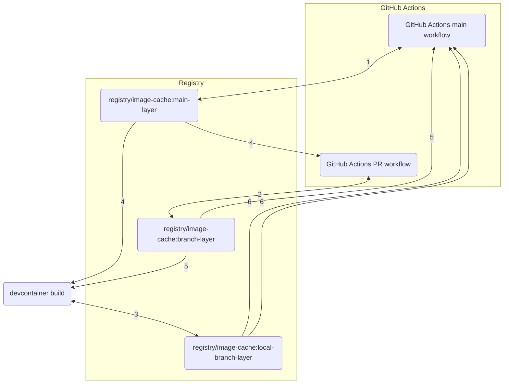

# devcontainer-cache-build

Build devcontainer images using remote Docker cache. This repo contains definitions for a complete workflow around the devcontainer image, including configuration for local building and cache population by CI pipeline.

## Usage

This repo defines tooling for the entire lifecycle of a devcontainer cache. Based on the context of the script call, `devcontainer-cache-build-initialize` supplies build configuration to target cache to refs for each event in that lifecycle, as described below:



1. GitHub Actions default branch workflows populate the cache for each layer, under the `main` ref.
2. GitHub Actions PR workflows populate the cache for each layer, under the ref for the PR branch name.
3. Devcontainer builds populate the cache for each layer, under the ref for the local branch name, with a `local-` prefix.
4. The `main` ref cache for each layer is used for builds in all contexts.
5. The branch ref cache for each layer is used for builds in all contexts.
6. The `local-`branch ref cache for each layer is used for builds in all contexts.

### Initialize script

The initialize script replaces `build` in `.devcontainer/devcontainer.json`, and computes appropriate configuration for the devcontainer image Docker build command. Internally, it wraps a Docker container run, in which the configuration logic and build execution is managed.

#### Initialize script basic usage

To use the script, add `"initializeCommand": "curl https://raw.githubusercontent.com/rcwbr/devcontainer-cache-build/0.4.0/devcontainer-cache-build-initialize | bash"` to your `devcontainer.json`, or to scripts referenced by it. For example, you might replace

```jsonc
{
  ...
  "build": {
    "dockerfile": "Dockerfile"
  },
  ...
}
```

with 

```jsonc
{
  ...
  "initializeCommand": ".devcontainer/initialize",
  "image": "my-project-devcontainer"
  ...
}
```

and `.devcontainer/initialize`:

```bash
#!/bin/bash

export DEVCONTAINER_IMAGE=my-project-devcontainer
curl https://raw.githubusercontent.com/rcwbr/devcontainer-cache-build/0.4.0/devcontainer-cache-build-initialize | bash
```

#### Initialize script specific version usage

A specific version of the script may be used by adjusting the URL in the `curl` command. The format is `https://raw.githubusercontent.com/rcwbr/devcontainer-cache-build/<version ref>/devcontainer-cache-build-initialize`, where `<version ref>` may be any valid version reference from this repo.

#### Initialize script bake usage

To use the `devcontainer-cache-build-initialize` script with [bake](https://docs.docker.com/reference/cli/docker/buildx/bake/), the recommended usage is to set the `DEVCONTAINER_BUILD_ADDITIONAL_ARGS` and `DEVCONTAINER_DEFINITION_FILES` vars to leverage bake file partials as defined in the [dockerfile-partials repository](https://github.com/rcwbr/dockerfile-partials/blob/main/README.md#devcontainer-bake-files-devcontainer-cache-build-usage).

If using a custom [bake file](https://docs.docker.com/build/bake/reference/), the config must contain the following configuration:

```hcl
variable "DEVCONTAINER_OUTPUTS" {
  default = ""
}
variable "DEVCONTAINER_CACHE_FROMS" {
  default = ""
}
variable "DEVCONTAINER_CACHE_TOS" {
  default = ""
}

target "default" {
  dockerfile = ".devcontainer/Dockerfile"
  cache-from = [
    for cache_from in split(" ", trimspace("${DEVCONTAINER_CACHE_FROMS}")):
    "${cache_from}-base"
  ]
  cache-to = [
    for cache_to in split(" ", trimspace("${DEVCONTAINER_CACHE_TOS}")):
    "${cache_to}-base"
  ]
  output = split(" ", trimspace("${DEVCONTAINER_OUTPUTS}"))
}
```

#### Initialize script inputs

The `devcontainer-cache-build-initialize` script reads several environment variables as configuration.

| Variable | Required | Default | Effect |
| --- | --- | --- | --- |
| `DEVCONTAINER_IMAGE` | &check; | N/A | The tag applied to the image build |
| `DEVCONTAINER_BUILD_ADDITIONAL_ARGS` | &cross; | N/A | Arbitrary additional args forwarded to the `build` or `bake` command, as comma-separated `key=value` pairs in [Python-on-whales syntax](https://github.com/gabrieldemarmiesse/python-on-whales) |
| `DEVCONTAINER_CACHE_BUILD_OVERRIDE_*` | &cross; | None | Special env variables to pass through to the build execution context, that may not be exportable. Supported variables are `USER`, `UID`, and `USER_GID` (e.g. `DEVCONTAINER_CACHE_BUILD_OVERRIDE_USER=my_username`...) |
| `DEVCONTAINER_CACHE_FROMS` | &cross; | `type=registry,ref=[DEVCONTAINER_REGISTRY]-cache:[current git branch name sanitized] type=registry,ref=[DEVCONTAINER_REGISTRY]-cache:local-[current git branch name sanitized] type=registry,ref=[DEVCONTAINER_REGISTRY]-cache:[DEVCONTAINER_DEFAULT_BRANCH_NAME, sanitized]` | Each [`cache-from` arg](https://docs.docker.com/reference/cli/docker/buildx/build/#cache-from) to be applied to the image build, space separated |
| `DEVCONTAINER_CACHE_TOS` | &cross; | `type=registry,rewrite-timestamp=true,mode=max,ref=[DEVCONTAINER_REGISTRY]-cache:[local-][current git branch name sanitized]` | Each [`cache-to` arg](https://docs.docker.com/reference/cli/docker/buildx/build/#cache-to) to be applied to the image build, space separated. The default value includes `local-` applied as a version prefix unless `CI=true` |
| `DEVCONTAINER_CONTEXT` | &cross; | `.` | The build context for the image |
| `DEVCONTAINER_DEFAULT_BRANCH_NAME` | &cross; | `main` | The branch name from which to always pull cache |
| `DEVCONTAINER_DEFINITION_TYPE` | &cross; | `build` | The image definition type, [basic Docker build (`build`)](https://docs.docker.com/reference/cli/docker/buildx/build/) or [Bake (`bake`)](https://docs.docker.com/reference/cli/docker/buildx/bake/) |
| `DEVCONTAINER_DEFINITION_FILES` | &cross; | `.devcontainer/Dockerfile`, or `.devcontainer/bake.hcl` if `DEVCONTAINER_DEFINITION_TYPE` is `bake` | The Dockerfile or bake config file path(s) for the image build, space separated |
| `DEVCONTAINER_INITIALIZE_PID` | &cross; | N/A | If defined, must be set to the process ID of the command provided to the `devcontainer.json` `initializeCommand` (often `$PPID`). Used to determine whether the context of the `initializeCommand` call is a new container bringup, based on the presence of the the [`--expect-existing-container`](https://github.com/devcontainers/cli/blob/9ba1fdaa11dee087b142d33e4ac13c5788392e34/src/spec-node/devContainersSpecCLI.ts#L196) argument |
| `DEVCONTAINER_OUTPUTS` | &cross; | `type=image,name=[DEVCONTAINER_REGISTRY],push=[DEVCONTAINER_PUSH_IMAGE]` | Each [`output` arg](https://docs.docker.com/reference/cli/docker/buildx/build/#output) to apply to the image build, space separated |
| `DEVCONTAINER_PREBUILD_SCRIPT` | &cross; | None | The path to a script to execute in advance of image build operations, e.g. for `docker login`s (see [Initialize script prebuild file usage](#initialize-script-prebuild-file-usage)). Relative to the repo root; must resolve to a file within the repo directory |
| `DEVCONTAINER_PUSH_IMAGE` | &cross; | `false` | Whether to push the image to the provided registry (requires `DEVCONTAINER_REGISTRY`) |
| `DEVCONTAINER_REGISTRY` | &cross; | `DEVCONTAINER_IMAGE` | The registry for the image and/or cache |
| `*` | &cross; | N/A | In the case of bake builds, all additional environment variables are forwarded to the build execution context |


The image build leverages any values provided or computed to `DEVCONTAINER_CACHE_FROM` as cache inputs.

#### Initialize script outputs

The `devcontainer-cache-build-initialize` script image build produces several outputs.

- An image in the local daemon image store (the [`image` output type](https://docs.docker.com/reference/cli/docker/buildx/build/#image)) at the name given by `DEVCONTAINER_IMAGE`
- Image build cache output published as specified by `DEVCONTAINER_CACHE_TO`

#### Initialize script prebuild file usage

The initialize script supports injecting a script (identified via the `DEVCONTAINER_PREBUILD_SCRIPT` env var) before build actions are taken, for example to perform authentication actions such as `docker login` within the initialize script container context. As the script must be available within the container context to execute, the value provided to `DEVCONTAINER_PREBUILD_SCRIPT` must be a file within the repository directory, so that it may be mounted to the container.

Env vars from the host (especially useful for authenication use cases) are available to the `DEVCONTAINER_PREBUILD_SCRIPT` script, but are remapped under a `DEVCONTAINER_HOST_` prefix. For example, `DOCKERHUB_PASSWORD` in the host would be available to the script as `DEVCONTAINER_HOST_DOCKERHUB_PASSWORD`.

#### Initialize script GitHub container registry setup

Configuring the `devcontainer-cache-build-initialize` script with a plain image name results in targeting outputs and cache to [DockerHub](https://hub.docker.com/) by default. Setting the `DEVCONTAINER_REGISTRY` to `ghcr.io/[your user/org name]` instead allows you to target the [GitHub container registry](https://docs.github.com/en/packages/working-with-a-github-packages-registry/working-with-the-container-registry) instead. To set up a container repository for this in a local environment, use [`docker login`](https://docs.docker.com/reference/cli/docker/login/) [against `ghcr.io`](https://docs.github.com/en/packages/working-with-a-github-packages-registry/working-with-the-container-registry#authenticating-with-a-personal-access-token-classic). For GitHub Codespaces environments, use the following steps:

1. Create a [Personal Access Token](https://docs.github.com/en/authentication/keeping-your-account-and-data-secure/managing-your-personal-access-tokens#creating-a-personal-access-token-classic) with [`write:packages` scope](https://docs.github.com/en/codespaces/reference/allowing-your-codespace-to-access-a-private-registry#publishing-a-package-from-a-codespace) for the repository to which the image belongs.
1. Add the token as a [Codespace secret](https://docs.github.com/en/codespaces/managing-your-codespaces/managing-your-account-specific-secrets-for-github-codespaces#adding-a-secret), to the repository to which the Codespaces environment belongs.
  1. Name the variable for the token secret as `[prefix for your repo]_CONTAINER_REGISTRY_PASSWORD`
1. Create another secret with the same name prefix but for the username `[prefix for your repo]_CONTAINER_REGISTRY_USER`, with the value set to your GitHub username
1. Create another secret with the same name prefix called `[prefix for your repo]_CONTAINER_REGISTRY_SERVER`, with the value set to `ghcr.io`

These are [automatically applied by GitHub](https://docs.github.com/en/codespaces/reference/allowing-your-codespace-to-access-a-private-registry#accessing-images-stored-in-other-registries) to authenticate in a Codespace. This is necessary because [other secrets are not accessible during Codespace image build](https://docs.github.com/en/codespaces/managing-your-codespaces/managing-your-account-specific-secrets-for-github-codespaces#using-secrets).

### GHCR registry setup

If using GHCR as the `DEVCONTAINER_REGISTRY`, the addition of any layer to the devcontainer definition involves configuring a registry for it with appropriate access. This is best achieved by leveraging the [GitHub Actions workflow](#github-actions-workflow), as registry configuration is established automatically. To do this, simply open a PR that contains the layer addition, before trying to rebuild a devcontainer/Codespace with the layer addition. Otherwise, registries may be created as private and require a manual settings change to make them public.

### GitHub Actions workflow

Leveraging the entire lifecycle of the devcontainer cache requires applying a CI/CD workflow to prepopulate cache. This may be achieved via the reusable workflow defined in `.github/workflows/devcontainer-cache-build.yaml`, e.g.:

```yaml
on: push
jobs:
  devcontainer-cache-build:
    uses: rcwbr/devcontainer-cache-build/.github/workflows/devcontainer-cache-build.yaml@0.4.0
    permissions:
      packages: write
```

The default behavior of the workflow provides arguments for use with the [useradd Dockerfile partial](https://github.com/rcwbr/dockerfile-partials/tree/main/useradd) for Codespaces user provisioning. These arguments must be forwarded to the `devcontainer-cache-build-initialize` script, e.g. via the `DEVCONTAINER_BUILD_ADDITIONAL_ARGS` variable:

```bash
# .devcontainer/initialize

export DEVCONTAINER_BUILD_ADDITIONAL_ARGS="$@"
curl https://raw.githubusercontent.com/rcwbr/devcontainer-cache-build/0.4.0/devcontainer-cache-build-initialize | bash
```

#### GitHub Actions workflow inputs usage

| Input | Required | Default | Type | Effect |
| --- | --- | --- | --- | --- |
| `build-context-user` | &cross; | `"codespace"` | string | The user name to set for the .devcontainer/initialize call |
| `build-context-uid` | &cross; | `1000` | number | The UID to set for the .devcontainer/initialize call |
| `build-context-gid` | &cross; | `1000` | number | The USER_GID to set for the .devcontainer/initialize call |
| `devcontainer-cache-build-image-override` | &cross; | `""` | string | The image name to use to override the default devcontainer-cache-build image |
| `initialize-args` | &cross; | `""` | string | Args to provide to the `devcontainer-cache-build-initialize` script; by default set to values for building Codespaces-compatible images |

## Contributing

### CI/CD

This repo uses the [release-it-gh-workflow](https://github.com/rcwbr/release-it-gh-workflow), with the conventional-changelog image defined at any given ref, as its automation.

It uses its own [reusable devcontainer cache build workflow](#github-actions-workflow) to pre-populate the devcontainer cache.

### Settings

The GitHub repo settings for this repo are defined as code using the [Probot settings GitHub App](https://probot.github.io/apps/settings/). Settings values are defined in the `.github/settings.yml` file. Enabling automation of settings via this file requires installing the app.

The settings applied are as recommended in the [release-it-gh-workflow usage](https://github.com/rcwbr/release-it-gh-workflow/blob/4dea4eaf328b60f92dab1b5bd2a63daefa85404b/README.md?plain=1#L58), including tag and branch protections, GitHub App and environment authentication, and required checks.

### Local image build

To build the devcontainer-cache-build tool image locally, use the following command:

```bash
docker builder create --use --driver docker-container # Skip if you already have a docker-container builder activated
export IMAGE_NAME=devcontainer-cache-build
docker buildx bake -f github-cache-bake.hcl -f cwd://docker-bake.hcl https://github.com/rcwbr/dockerfile-partials.git#0.4.0
```
